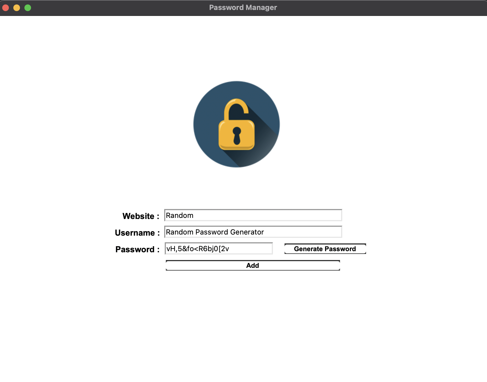

# PasswordManager

A simple and secure password management application built with Python and Tkinter. Generate strong, customizable passwords and save your login details effortlessly.



## Features
- Generate strong passwords with customizable counts of letters, numbers, and special characters.
- Save website, username, and password details securely to a text file.
- User-friendly graphical interface with attractive visuals.
- Password generator logic encapsulated within a class for reusability.

## How to Use
1. Run the `main.py` script.
2. Enter the website name, username/email.
3. Click "Generate Password" to create a strong password automatically.
4. Click "Add" to save the details into `password_log.txt`.
5. Confirm the details before saving.

## Folder Structure
```
PasswordManager/
│
├── 1.png               # Image used in README and UI
├── lock2.png           # Additional image (if used)
├── main.py             # Main application code
├── PasswordGenerator.py # Password generator class
└── password_log.txt    # Log file for saved passwords
```

## Dependencies
- Python 3.x
- Pillow (`pip install pillow`)
- Tkinter (usually comes with Python)

## Example Usage
```python
from PasswordGenerator import PasswordGenerator

ps = PasswordGenerator()
password = ps.get_password(8, 4, 4)
print(f"Generated Password: {password}")
```

## Acknowledgments
📚 The main idea of this project was inspired by a Python course. I implemented additional features like the UI, password generation, and data saving myself. This project helped me improve my Python and Tkinter skills. Feel free to customize it!

*Note:* I followed the guidelines and concepts from the course, but most of the implementation is my own.

---

**Happy coding!** 🚀
